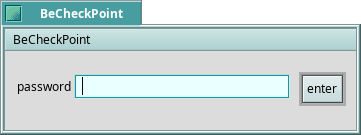

# BeCheckPoint v1.0.2
### 1/23/99, John Wiggins

BeCheckPoint is a login type application. When launched, it kills the Tracker and Deskbar, (and mail_daemon if its running). After killing off all the useful stuff :) you get a password prompt. You can't do much of anything until you enter your password (appropriately so :). After you enter a correct password, BeCheckPoint unkills everything it killed at startup and exits.

The function that kills stuff is kinda rough if the Tracker is having problems, but I only saw these problems when the Tracker was trying to talk to a half-connected disk drive. If everything is cool though, BeCheckPoint should work like a charm. Please test it before you add it to your userbootscript. 

version 1.0.2:
Compiled for R4. Added minor improvements
- Password field is now active at startup. No need to click before entering your password
- Password change dialog now asks you to type the new password a second time. Like it should :)
- You don't have to ask me for the source anymore.
- Compiles without warnings using gcc (damn! :P)

version 1.0.1:
This version is a complete rewrite after I rather stupidly deleted the original source code. This version is a bit nicer than the first. Some of the differences are:
- All password feilds use my PassControl class so that prying eyes only see stars (***).
- Will not reboot your computer if you give it a bad password. I took out that rather rude :) feature and replaced it with a hearty "window shaking". Test out the app for yourself to see what I mean.
- Cleaner than the first version. I originally wrote this app as an intro to BeOS programming. Since then I have changed the way I do things. (for the better of course) There might actually be more error checking in this version too. I can't remember how much there was in the first.

----------------------
Warning label
----------------------
I am not responsible for any nasty stuff that happens to your computer as a result of running this program. I have tested it semi-thoroughly and it this version works fine on the hardware I have tested it on. Your mileage may vary. I take no responsibility for your computer. Deal with it. yadda yadda. This warning is pretty standard.
